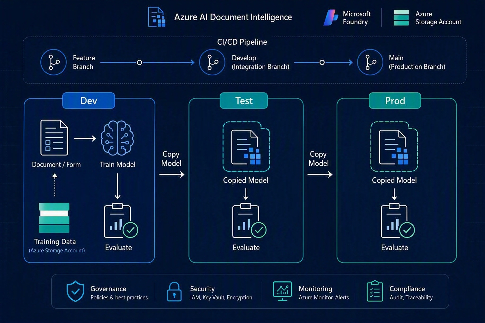

# Document Intelligence MLOps Sample

Moves a custom Azure AI Document Intelligence model through **Dev → Test →
Prod** safely: **train once in Dev**, then **promote the exact same trained
model by copying it** to Test and Prod — never retrain there, never move the
training data there. Every environment is evaluated against its own
held-out validation documents — the model's extracted field values and
confidence scores are recorded for a human to review — and promoting to
the next environment is always a deliberate decision, driven by merging a
pull request from a `dev/*` branch into a `test/*` branch, or `test/*` into
`main`.



```
 dev/* branch                     test/* branch                   main branch
 ┌───────────────────────┐        ┌───────────────────────┐       ┌───────────────────────┐
 │ 1. Label docs (Studio)│        │ 3. PR dev/* -> test/*, │       │ 5. PR test/* -> main,  │
 │ 2. Run workflow:       │──────▶│    merge                │──────▶│    merge                │
 │    train.py            │  PR   │    -> promote_pending_  │  PR   │    -> promote_pending_  │
 │    + evaluate.py       │       │       models.py         │       │       models.py         │
 │    (manual, by hand)   │       │    -> evaluate.py       │       │    -> evaluate.py       │
 └───────────────────────┘        └───────────────────────┘       └───────────────────────┘
```

---

## 1. Set up the environments (do this once)

This sample uses three environments — `dev`, `test`, `prod` — but any number
of environment names work (e.g. add a `staging` stage between test and
prod). Each is its own Document Intelligence resource, identified by a
`<NAME>_DI_ENDPOINT` secret. Repeat the table below for `dev`, `test`, and
`prod` (only Dev also needs storage/Studio/managed identity steps):

> Branch names and environment names are independent: `dev/*` and `test/*`
> branches are matched by **prefix** (e.g. `dev/main`, `dev/feature-x`,
> `test/main`) — only the prefix matters, so teams can use their own
> branch-naming convention after it. **Prod maps to the repo's `main`
> branch** — there's no `prod/*` prefix, `main` simply *is* Prod. Change
> the `dev`/`test` prefixes themselves in
> `.github/workflows/model-pipeline.yml` if they don't fit.

| Step | Dev | Test | Prod |
|---|---|---|---|
| Create a Document Intelligence resource | ✅ | ✅ | ✅ |
| Grant the **pipeline's identity** (federated SPN) the `Cognitive Services User` role on it | ✅ | ✅ | ✅ |
| Create a Storage account, with one container per doc type (`<doc-type>`) | ✅ | | |
| In each container, create a `training/` prefix and a `validation/` prefix | ✅ | | |
| Enable **system-assigned managed identity** on the DI resource | ✅ | | |
| Grant that managed identity `Storage Blob Data Reader` on the storage account | ✅ | | |
| Grant the **pipeline's identity** `Storage Blob Data Reader` on the storage account (it reads `validation/` directly) | ✅ | | |
| Set storage CORS to allow Document Intelligence Studio's origin | ✅ | | |
| Connect a Document Intelligence Studio project to the `training/` prefix of each container and label documents | ✅ | | |
| Upload a handful of held-out documents to `validation/` for a human to review the model's output against | ✅ | | |

Exact `az` commands for the managed identity + RBAC steps are in the header
comment of `src/train.py`.

**GitHub repo secrets to set** (Settings → Secrets and variables → Actions):

```
DEV_DI_ENDPOINT
TEST_DI_ENDPOINT
PROD_DI_ENDPOINT
DEV_TRAINING_STORAGE_ACCOUNT
AZURE_CLIENT_ID / AZURE_TENANT_ID / AZURE_SUBSCRIPTION_ID
```

No resource keys anywhere. Each pipeline job logs in via **OIDC to a
federated service principal** (`azure/login` step) using the last three
secrets above; `DefaultAzureCredential` in `src/common.py` then picks up
that session automatically. That same code path also supports a **managed
identity** transparently when running on Azure compute instead of GitHub
Actions.

`DEV_TRAINING_STORAGE_ACCOUNT` is the one storage account shared by every
doc type in Dev; each doc type resolves to its own container within it
(`<account>/<doc-type>`). A doc type whose container lives somewhere
different can set `DEV_TRAINING_CONTAINER_URL_<DOC_TYPE>` instead (see
`common.resolve_training_container_url`).

Configure the `test` and `prod` GitHub Environments with required reviewers
so the pipeline pauses before copying a model into each — giving whoever
approves it a chance to look at the previous job's evaluation report first.

## 2. Label, train, and evaluate

1. Open **Document Intelligence Studio**, connect your project to the
   `training/` prefix of the Dev container, and label your documents. This
   writes `fields.json`/`*.ocr.json`/`*.labels.json` directly into that
   prefix — nothing touches Git.
2. Upload a handful of documents the model never trains on to `validation/`
   — also never touches Git.
3. When labeling is ready, trigger training by hand: **Actions →
   Document Intelligence Model Pipeline → Run workflow**, choosing the
   `dev/*` branch to commit to and passing `doc_type`, `model_kind`, and
   `version_bump`. Training is never automatic — it's always a deliberate
   action a person takes once labeling is actually ready.

Either way the same two steps run in Dev:

```
train.py (Dev, bumps version, e.g. invoice-v1.1.0)  ->  evaluate.py (Dev, extracts + records field values/confidence)
```

`evaluate.py` doesn't score "correct vs incorrect" — there's no
known-correct values to compare against. It runs the model over every
`validation/` document and writes the extracted field values and confidence
scores to a report for you to read. Look at the uploaded
`manifest-and-reports-dev` artifact (full detail in `reports/*.json`, a
summary pointer in the manifest's `evaluations.dev`). Promotion to Test and
Prod happens by opening a PR from a `dev/*` branch — see section 3.

You can also run every step by hand locally, in the same order:

```
python src/train.py       --doc-type invoice
python src/evaluate.py    --doc-type invoice --env dev  --model-id <model-id-from-above>
python src/copy_model.py  --doc-type invoice --model-id <model-id> --source dev  --target test
python src/evaluate.py    --doc-type invoice --env test --model-id <model-id>
python src/copy_model.py  --doc-type invoice --model-id <model-id> --source test --target prod
python src/evaluate.py    --doc-type invoice --env prod --model-id <model-id>
```

`config/models/<doc-type>.json` is updated automatically after every step —
it's always the single source of truth for which model id (and version) is
live in which environment for that doc type. Each doc type gets its own
file, so a repo with many doc types never makes any single file bigger than
a repo with one. It only stores a small pointer to each evaluation run
(document count, average confidence, report path) — never the full
per-field results — so it stays small no matter how many documents or runs
accumulate; full detail always lives in `reports/<doc-type>/`.

## 3. Branch-per-environment CI/CD

This sample maps git **branch prefixes** onto Dev and Test, and the repo's
**`main` branch onto Prod**: any branch starting with `dev/` → Dev, `test/`
→ Test (e.g. `dev/main`, `test/main`, or `dev/feature-x` — only the prefix
is matched), while `main` itself is always Prod. Nothing is ever trained on
a `test/*` branch or on `main` — those only ever *promote* a model that was
already trained and evaluated on a `dev/*` branch. A model is never "in" a
branch (it lives in Document Intelligence), so what actually moves between
branches is the **state file** that records which model id/version is live
where.

```
dev/* branch                   test/* branch                  main branch
────────────                   ─────────────                  ───────────
Run workflow: train.py         PR dev/* -> test/*, merge       PR test/* -> main, merge
  + evaluate.py (manual)        -> promote_pending_models.py    -> promote_pending_models.py
     (commits state file to       (copy_model.py + evaluate.py,   (copy_model.py + evaluate.py,
      this dev/* branch)          commits state file to test/*)   commits state file to main)
```

**Triggering training** — there is no auto-trigger and no trigger file to
maintain. A person runs **Actions → Document Intelligence Model Pipeline →
Run workflow**, choosing the `dev/*` branch to commit to and providing
`doc_type`, `model_kind`, and `version_bump`. The `train` job then runs
`train.py` + `evaluate.py` for that doc type, and commits the updated
`config/models/<doc-type>.json` back to that same branch. Training is
always a deliberate action — it's never a side effect of a Git push.

**Promoting** — open a pull request from a `dev/*` branch into a `test/*`
branch (or from `test/*` into `main`) whenever you're ready to promote
what's currently on that branch. Reviewing that PR (its diff is just the
state file(s) under `config/models/`, plus any code changes) *is* the
promotion decision — informed by the evaluation reports uploaded as
artifacts from the previous run. Once merged:

- `promote-to-test` runs `promote_pending_models.py`, which compares each
  doc type's state file on the source `dev/*` branch to the same file on
  the target `test/*` branch: for every doc type where the source's
  `environments.dev` has a different (newer) `modelId` than the target's
  `environments.test`, it runs
  `copy_model.py` + `evaluate.py` and commits the result back to the
  `test/*` branch.
- `promote-to-prod` does the same thing comparing a `test/*` branch's
  state files to `main`'s.
- A doc type that hasn't changed is skipped — "already at `<model-id>`,
  skipping." Nothing is re-copied or re-evaluated unnecessarily.

The `test` and `prod` GitHub Environments (configured with required
reviewers) still gate the promotion jobs themselves, so even after a PR is
merged, a second approval can be required before the copy actually happens.

## Model versioning

Every `train.py` run bumps the model's semantic version (`major.minor.patch`,
default: `minor` — override with `--version-bump major|minor|patch`) and
encodes it directly into the model id, e.g. `invoice-v1.2.0`, so the exact
version is visible both in its state file and in Document Intelligence itself.

Each doc type's state file (`config/models/<doc-type>.json`) tracks:
- `version` — the current (latest) semantic version.
- `history` — one entry per training run ever done in Dev (version, model id,
  model kind, timestamp) — nothing is overwritten, so you always have a full
  audit trail of every model trained.
- `environments.<env>.modelVersion` — which version is live in that
  environment. `copy_model.py` carries this forward automatically when
  promoting, so Test/Prod always show which version they're running.
- `evaluations.<env>` — one summary entry per evaluation run in that
  environment (model id, version, document count, average confidence, report
  path), capped to the most recent `MAX_EVALUATIONS_PER_ENVIRONMENT` (20 by
  default, see `common.py`) so it never grows unbounded.

```
python src/train.py --doc-type invoice                       # 0.0.0 -> 0.1.0 (default: minor)
python src/train.py --doc-type invoice --version-bump patch  # 0.1.0 -> 0.1.1
python src/train.py --doc-type invoice --version-bump major  # 0.1.1 -> 1.0.0
```

## Why it's built this way

- **Copy, don't retrain**: promoting via `copy_model.py` guarantees Test and
  Prod run the *exact same* model artifact that was validated — no drift.
- **Training and validation data never leave Dev, and never enter Git**:
  `train.py` reads `training/` and `evaluate.py` reads `validation/`
  directly from Blob Storage. `.gitignore` and `tests/test_schema.py`
  enforce that no dataset folder is ever committed.
- **Evaluation records what the model extracted, it doesn't judge it**:
  `evaluate.py` runs the model against `validation/` and writes the field
  values and confidence scores it found to a report — there's no
  known-correct values to compare against, so it can't score "right or
  wrong" itself. Whether that's accurate enough, and whether to promote
  (`copy_model.py`), is always a separate, deliberate decision made by a
  developer or team reading the report.
- **The state file stays small on purpose**: each doc type's
  `config/models/<doc-type>.json` only stores a pointer to each
  evaluation run (document count, average confidence, report path, capped
  to the most recent 20 per environment) — never the full per-field
  results. Full detail always lives in `reports/<doc-type>/`. Splitting by
  doc type also means no single file grows with the total number of doc
  types in the repo.
- **Every model is versioned, never overwritten**: retraining in Dev bumps
  the semantic version and appends to `history` instead of replacing the
  previous entry, so you can always see (and roll back to) any past model.
- **Branches drive promotion, the state file is the diff**: a model can't
  literally live "in" a branch, so each `dev/*`/`test/*` branch and `main`
  carries its own copy of `config/models/`, and merging a PR
  between them is what triggers `promote_pending_models.py` to compare the
  two and copy whatever's newer — using ordinary code-review tooling (PRs,
  required reviewers) as the approval mechanism instead of a bespoke one.

## Multiple models

Nothing extra to build — this already supports any number of doc types (and
template/neural/composed models) side by side:

- Each doc type gets its own file at `config/models/<doc-type>.json` (own
  thresholds, own per-environment model ids/metrics) — just run
  `train.py --doc-type <your-doc-type>` once, which creates it for you
  (or copy `config/models/_template.json` to start one by hand).
- Create a Dev container for the doc type with `training/` and `validation/`
  prefixes (see setup checklist above).
- Run any script or the pipeline with `--doc-type <your-doc-type>` /
  the `doc_type` workflow input — everything else works unchanged.

Composed models (combining several child models into one, e.g. per vendor)
follow the same flow — build the child models and the composed model in
Dev, then copy/evaluate the composed model id through Test and Prod like
any other model id.

## Extending beyond dev/test/main

Every script takes an environment name as a plain string (`--env`,
`--source`, `--target`), resolved from a `<NAME>_DI_ENDPOINT` env var —
there's no fixed list to edit. To add a stage (e.g. `staging` between test
and prod): create the resource, set its endpoint secret, grant the pipeline
identity access to it, use `staging/*` as that stage's branch prefix, and
add one more `promote_pending_models.py` + `evaluate.py` job to the
pipeline (copy the `promote-to-test`/`promote-to-prod` job and adjust
`--upstream-env`/`--this-env` and the branch checks).

## Repo layout

```
config/models/<doc-type>.json  # source of truth per doc type: version, history, and per-environment model id + evaluation pointers
config/models/_template.json   # copy this to hand-create a new doc type's state file
src/
  common.py                   # shared helpers: connect to an environment, resolve containers, read/write per-doc-type state files
  train.py                    # Build Model from training/ (Dev only), bumps version
  evaluate.py                 # Analyze validation/ documents, record extracted values + confidence (no scoring, no gating)
  copy_model.py                # Copy a trained model to the next environment
  promote_pending_models.py    # test/main branch: diffs two branches' config/models/ directories, copy_model.py + evaluate.py for what's newer upstream
tests/
  test_schema.py               # validates each config/models/*.json file, and that no dataset folder was committed
  test_evaluation_reports.py   # prints a confidence summary of evaluate.py's reports (informational only)
.github/workflows/model-pipeline.yml   # manual dispatch -> train, test/*|main PR merge -> promote, with approval gates
```

There is no local `datasets/` folder in this sample — training and
validation documents live only in each doc type's Dev Blob Storage
container, under `training/` and `validation/`. `reports/<doc-type>/` is
also not committed (see `.gitignore`) — only `config/models/` is.

